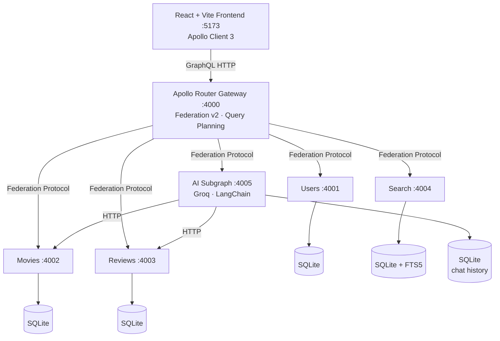

# MovieDB — GraphQL Federation Platform


A full-stack movie discovery and review platform built on **Apollo Federation v2**. Independent GraphQL subgraph services compose into a single unified API, served by an Apollo Router gateway. Includes an AI movie assistant powered by Groq + LangChain.

---

## Architecture



Each service is an independent Bun process with its own SQLite database. Subgraphs share no code at runtime — only the federation protocol connects them.

---

## Services

| Service  | Port | Owns                          | Notes                                         |
|----------|------|-------------------------------|-----------------------------------------------|
| Users    | 4001 | `User`, `AuthPayload`         | JWT (HS256), bcryptjs                         |
| Movies   | 4002 | `Movie`, genres               | Full CRUD, paginated list                     |
| Reviews  | 4003 | `Review`, ratings             | Extends `Movie` with avgRating                |
| Search   | 4004 | `SearchResult`, trending      | SQLite FTS5, polls every 30s                  |
| AI       | 4005 | `Chat`, conversation history  | Groq llama-3.3-70b, LangChain tool-calling    |
| Gateway  | 4000 | Supergraph (composed schema)  | Apollo Router binary                          |
| Frontend | 5173 | React SPA                     | nginx in Docker, Vite in dev                  |

---

## How GraphQL Federation Works

**Federation** lets you split a GraphQL schema across multiple services without a monolith.

1. **Each subgraph** defines its slice of the schema independently. The Users service defines `User`. The Reviews service defines `Review`.

2. **Entities** (`@key` directive) let subgraphs reference types from other services. Reviews extends `Movie` — defined in the Movies service — to add `avgRating` and `reviewCount`.

3. **Apollo Router** runs `rover supergraph compose` to merge all subgraph schemas into a single **supergraph SDL**. It uses this to build optimal query plans at request time.

4. **The client** sends one query to `:4000`. The router fetches from whichever subgraphs are needed, in parallel where possible, then merges the results.

```graphql
# One client query, three subgraphs involved:
query {
  movieById(id: "1") {   # → Movies service
    title
    avgRating            # → Reviews service (extends Movie)
    reviews {
      user { username }  # → Users service (entity resolution)
    }
  }
}
```

---

## Getting Started

### Prerequisites

- [Bun](https://bun.sh) ≥ 1.0
- [Docker + Docker Compose](https://docs.docker.com/compose/)
- [Rover CLI](https://www.apollographql.com/docs/rover/) (`npm i -g @apollo/rover`)
- [Groq API key](https://console.groq.com) — set as `GROQ_API_KEY` in `.env`

### Run locally

```bash
# 1. Compose the supergraph schema (file-based, no services needed)
bash compose-supergraph.sh

# 2. Build Docker images
docker compose build

# 3. Start everything
docker compose up
```

Frontend: http://localhost:5173
Gateway: http://localhost:4000/graphql

### Development (without Docker)

```bash
# Install all workspace deps
bun install

# Start a specific service
cd services/users && bun run dev   # :4001
cd services/movies && bun run dev  # :4002
cd services/ai && bun run dev      # :4005
```

---

## Project Structure

```
graphql/
├── apps/
│   └── web/                    # React + Vite frontend
├── services/
│   ├── users/                  # Auth subgraph (:4001)
│   ├── movies/                 # Catalog subgraph (:4002)
│   ├── reviews/                # Reviews subgraph (:4003)
│   ├── search/                 # Search subgraph (:4004)
│   ├── ai/                     # AI assistant service (:4005)
│   │   └── src/
│   │       ├── agent.ts        # LangChain agent + Groq LLM
│   │       ├── tools.ts        # list_movies, get_movie_details, add_movie, add_review
│   │       ├── schema.ts       # GraphQL schema (chat queries/mutations)
│   │       └── db.ts           # SQLite conversation history
│   └── gateway/                # Apollo Router config + supergraph
├── packages/
│   └── shared/                 # Shared: logger, jwt, errors, types
├── supergraph.yaml             # rover compose config (file-based)
├── compose-supergraph.sh       # Run before docker compose build
└── docker-compose.yml
```

---

## AI Assistant

The AI service (`services/ai`) is a **federation subgraph** (uses `buildSubgraphSchema`, registered in `supergraph.yaml`) that wraps a LangChain tool-calling agent. It is composed into the supergraph and accessible through the gateway at `:4000/graphql`.

**How it works:**

1. The frontend sends a `chat` mutation with the user's message and a conversation ID
2. The agent loads prior messages from SQLite (conversation history per session)
3. Groq (`llama-3.3-70b-versatile`) decides which tools to call
4. Tools make HTTP calls to the movies and reviews services
5. The final response is persisted and returned

**Available tools:**

| Tool               | What it does                                       |
|--------------------|----------------------------------------------------|
| `list_movies`      | Browse the catalog (supports genre/search filters) |
| `get_movie_details`| Fetch a movie's full info and its reviews          |
| `add_movie`        | Add a new movie (requires auth)                    |
| `add_review`       | Submit a review for a movie (requires auth)        |

**Env vars required:**

```
GROQ_API_KEY=...
MOVIES_SERVICE_URL=http://movies:4002
REVIEWS_SERVICE_URL=http://reviews:4003
JWT_SECRET=...
```

---

## Key Federation Directives

| Directive    | Purpose                                                               |
|--------------|-----------------------------------------------------------------------|
| `@key`       | Marks an entity's primary key. Makes the type resolvable across subgraphs. |
| `@external`  | Field is owned by another subgraph, imported for local use.          |
| `@requires`  | This field needs fields from another subgraph to resolve.            |
| `@provides`  | Hints that this subgraph can provide certain fields for an entity.   |
| `@shareable` | Field can be resolved by multiple subgraphs.                         |

---

## Auth

- JWT signed with `HS256` using `JWT_SECRET` env var
- Verified in all subgraphs via the `jose` library (pure JS, Alpine-safe)
- Passwords hashed with `bcryptjs`
- Token passed as `Authorization: Bearer <token>` header

---

## Easter Eggs

- **Logo (header)** — click 5 times quickly for a secret toast
- **Konami code** — `↑ ↑ ↓ ↓ ← → ← → B A` anywhere on the page
- **Architecture page** — Matrix Mode toggle in the top-right corner

---

## License

MIT — see [LICENSE](./LICENSE)
